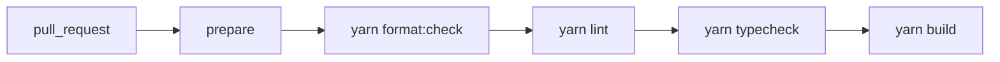

# Checks workflow

[`.github/workflows/checks.yml`](../.github/workflows/checks.yml) — verifies a
change before it ships.

## Triggers

Pull requests only. Every change reaches `next` through one, and `main` only
ever receives `next` through the release sync, so running again on the push
would re-check a commit that already passed.

Steps run cheapest-first, so an obvious failure reports without waiting for a
full build. Each is the same root command you run locally — the workspace-level
equivalents do not work, see the README.

## Notes

- **`concurrency` cancels in progress.** Unlike publish and deploy, a checks run
  is safe to interrupt: a newer commit supersedes the result entirely.
- **No `fetch-depth: 0`.** Nothing here reads git history, unlike
  [publish](./publish-workflow.md), which needs it to diff against the last
  release.
- **`yarn typecheck` covers the root project too**, not just the workspaces —
  `turbo.json` declares a `//#typecheck:root` task for `tsconfig.json`, which
  type-checks the repo's own `.mjs` scripts.
- Workflow files themselves are **not** validated here. `actionlint` catches
  schema errors that YAML parsing cannot — an empty `permissions:` once made a
  workflow silently unrunnable — and is worth adding if the workflows grow.
