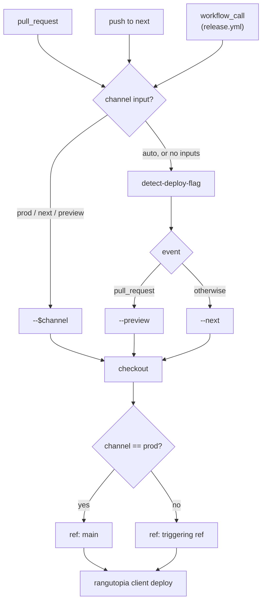

# Deploy workflow

[`.github/workflows/deploy.yml`](../.github/workflows/deploy.yml) — deploys the
Storybook app to Vercel.

## Triggers

| Trigger         | Target                                        | Environment  |
| --------------- | --------------------------------------------- | ------------ |
| Pull request    | `--preview`                                   | `preview`    |
| Push to `next`  | `--next`                                      | `next`       |
| `workflow_call` | `channel` input — `release.yml` passes `prod` | `production` |

There is no `main` trigger. Production is reached only through
[`release.yml`](./release-workflow.md), which calls this workflow after a
successful publish so the two can never get out of order.

## Notes

- **The channel implies the ref.** `channel: prod` checks out `main`; anything
  else falls back to the triggering ref. This matters because in a called
  workflow `github.ref` is the branch the _release_ was dispatched from, not the
  branch being released — so relying on it would deploy the wrong commit.
- **Inputs live only under `workflow_call`.** `type: choice` is a
  `workflow_dispatch`-only feature, so `channel` is a plain `string`.
- **`concurrency`** is keyed per branch/PR with `cancel-in-progress: true` — a
  newer commit makes an in-flight deploy of the same ref pointless.
- rangutopia locates the build output through `apps/storybook`'s `main` field,
  which is why a private app declares one.
