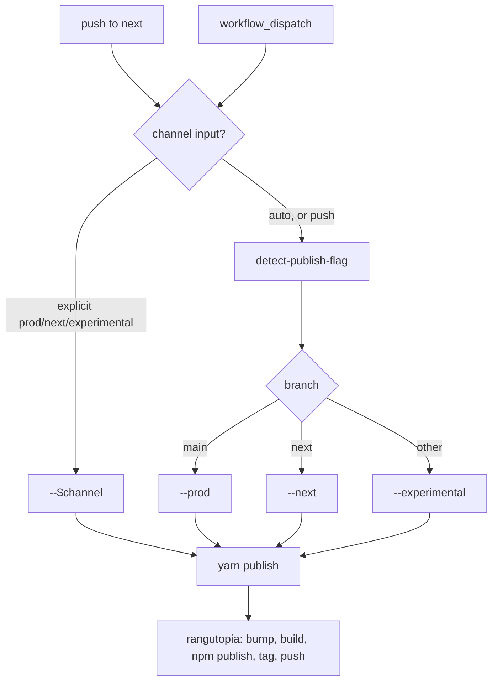

# Publish workflow

[`.github/workflows/publish.yml`](../.github/workflows/publish.yml) — publishes
`@arthur2079/whale2` to npm.

This is the **only** entry point for publishing. npm trusted publishing
authorises the workflow that _starts_ a run and binds it to a workflow filename,
so every publish has to originate here — including production releases, which
[`release.yml`](./release-workflow.md) starts by dispatching this workflow rather
than calling it.

## Triggers

| Trigger             | Channel                                                  |
| ------------------- | -------------------------------------------------------- |
| Push to `next`      | `--next` (prerelease)                                    |
| `workflow_dispatch` | `channel` input, or the branch when it is left on `auto` |

The `channel` input is a `choice` of `auto · prod · next · experimental`. When it
is `auto` — and on `push`, where the `inputs` context does not exist at all —
the flag comes from the branch instead.

## Notes

- **`concurrency: publish`**, with `cancel-in-progress` left at its default of
  `false`. rangutopia pushes commits and tags, so a cancelled run could leave npm
  and git disagreeing. The group is deliberately _not_ shared with
  `release.yml` — a release blocks waiting on a publish run it dispatched, so a
  shared group would have the parent holding the lock its child needs.
- Authentication is `NODE_AUTH_TOKEN` (`secrets.NPM_TOKEN`) against the registry
  that the `prepare` action configures.
- `fetch-depth: 0` is required: rangutopia detects changed packages by diffing
  against the last release commit or tag.
