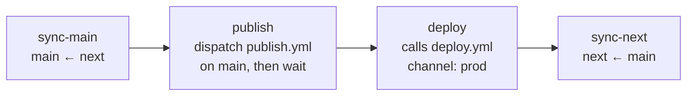
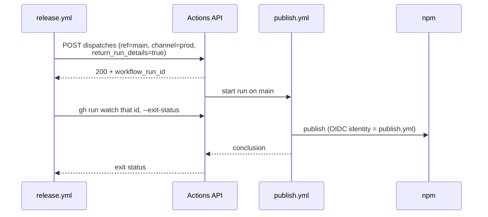

# Release workflow

[`.github/workflows/release.yml`](../.github/workflows/release.yml) — the
production release.

Dispatch-only, and it **always operates on `main`** no matter which branch it is
dispatched from: the sync script targets `main` explicitly, the later jobs pin
`ref: main`, and the publish is dispatched on `main`.

| Job         | Timeout | Notes                                                   |
| ----------- | ------- | ------------------------------------------------------- |
| `sync-main` | 10 min  | Merges `next` into `main` via `scripts/sync-branch.mjs` |
| `publish`   | 45 min  | Dispatches and waits; does not publish itself           |
| `deploy`    | —       | `uses:` call, so its timeout lives in `deploy.yml`      |
| `sync-next` | 10 min  | Merges `main` back into `next`                          |

## Why the publish is dispatched, not called

npm trusted publishing authorises the workflow that **starts** a run and binds it
to a workflow filename. A reusable `uses:` call would present `release.yml` as
the identity and fail authentication, so the publish must be its own run.

`return_run_details: true` makes the dispatch return the created run's id
instead of a bare `204`, so the release waits on exactly the run it started
rather than guessing from a listing.

The deploy has no such constraint — nothing in it authenticates by workflow
identity — so it is a plain reusable call and its steps are not duplicated here.

## Notes

- **`concurrency: release`**, not shared with `publish.yml`. The `publish` job
  blocks on a run it dispatched, so one group spanning both would deadlock the
  parent against its child. `cancel-in-progress` stays `false`.
- **Publish runs before deploy**, so a failed publish leaves the deployed site
  untouched rather than shipping a Storybook whose package never reached npm.
- **Cancelling a release does not cancel the dispatched publish** — it is a
  separate run and cancellation does not cascade. Stop it from the URL the job
  logs.
- The sync commits carry `[skip ci]`, so syncing `next` at the end does not
  trigger another prerelease publish.
- Pushes use the default `GITHUB_TOKEN`. Branch protection that blocks
  `github-actions[bot]` from pushing to `main` or `next` is not supported by this
  pipeline.
